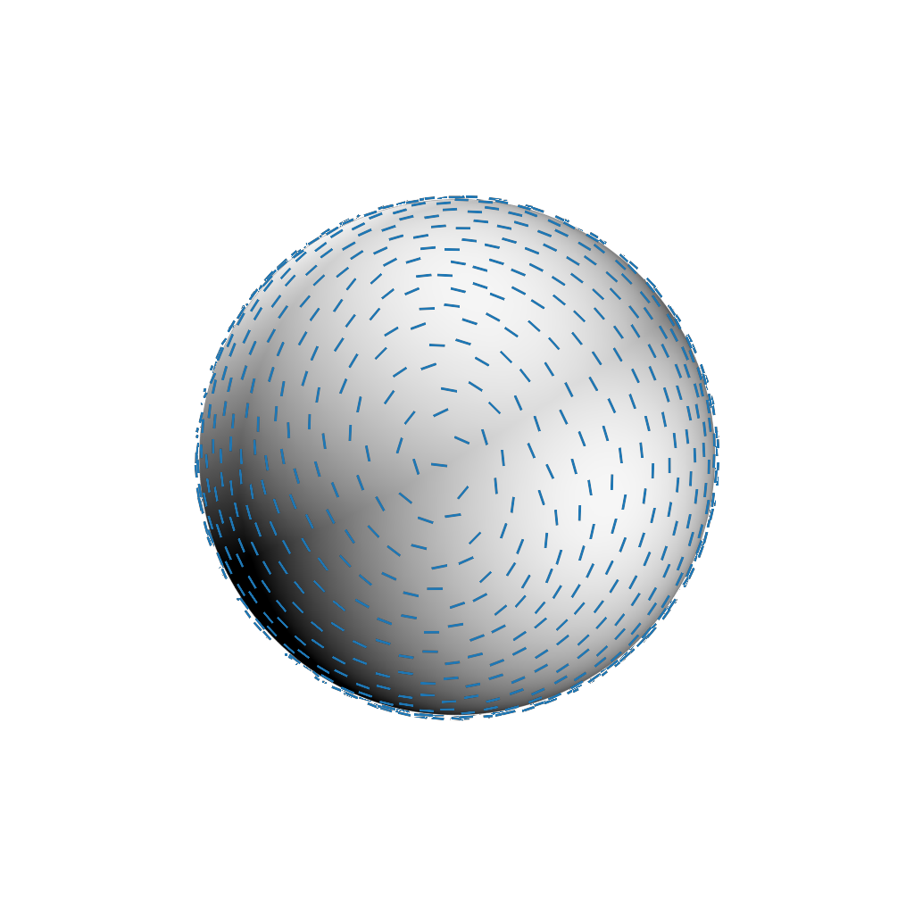

# Stroke Transfer: Example-based Synthesis of Animatable Stroke Styles

This repository contains the published code for the paper "Stroke Transfer: Example-based Synthesis of Animatable Stroke Styles".


<div align="center">  

[](http://www.cg.it.aoyama.ac.jp/yonghao/sig22/abstsig22.html)
[](http://www.cg.it.aoyama.ac.jp/yonghao/sig22/StrokeTransfer.pdf)
[](https://youtu.be/jZJJ1Wi94bM)

</div>

## Dependencies

The project was developed using Python 3 (Anaconda environment) with the following packages.

[Anaconda default packages]
- NumPy
- SciPy
- matplotlib
- PyQt5

[Additional dependencies]
- OpenCV
- PyOpenGL
- glumpy
- point cloud utils
- libigl
- pydec
- h5py
- imageio (OpenEXR format)
- tqdm


## Quick Start

We provide example assets (e.g., "assets/monkey") for demo usage (you can quickly test the pipeline).

### [assets/monkey](assets/monkey)

|  Exemplar  |  Reference Rendering  | Stroke Rendering |
| ---- | ---- | ---- |
|    |   |    |

### [assets/deforming_sphere](assets/deforming_sphere)

|  Exemplar  |  Reference Rendering  | Stroke Rendering |
| ---- | ---- | ---- |
|    |   |    |


### Asset Structure

We have tested a workflow with the blender (3.0 or higher) for 3DCG asset preparation.

[src] single frame data mainly used for regression process.
- exemplar.png: exemplar image (.png) drawn by the artist.
- annotation.json: annotation file (.json) exported from annotation tool (0_annotation.py)
- texture.png: brush texture image used for stroke rendering.
- object_001.obj: 3D model data (.obj) exported from 3D CG software.
- camera_001.json: 3D camera parameter file (.json) exported from 3D CG software (blender/export_camera.py).
- diffuse_001.exr: diffuse image (.exr) exported from 3D CG software.
- specular_001.exr: specular image (.exr) exported from 3D CG software.


[target] animated sequences to apply stroke transfer.
- object/object_%03d.obj: 3D model data (.obj) exported from 3D CG software.
- camera/camera_%03d.json: 3D camera parameter file (.json) exported from 3D CG software (blender/export_camera.py).
- diffuse/diffuse_%03d.exr:  diffuse image (.exr) sequences exported from 3D CG software.
- specular/specular_%03d.exr: specular image (.exr) sequences exported from 3D CG software.

If you are interested in preparing custom asset with the blender, please see the manual ([3D CG Asset Preparation](./docs/AssetPreparation.md)).

- camera parameters (.json).
- 3D model data (.obj).

The other diffuse or specular image can be generated with usual blender menus.

## Usage

To run our pipeline, please first move to the target asset directory.

```shell
cd assets/deforming_sphere
```

Now you can run each pipeline (command line tool) to output stroke transfer result.

### Command Line Tool Format

Each command line tool accepts a single XML file to configure the settings.

e.g. you can run smoothing process in the following manner.

```shell
python ../../python/3_smoothing.py xml/3_smoothing.xml
```

The XML includes input/output settings and parameters to change the results of the pipeline.

```xml: 3_smoothing.xml
<?xml version="1.0"?>
<smoothing>
  <!-- input setting -->
  <orientation filename_template ="dst/transfer/orientation/orientation_%03d.json"/>
  <object filename_template = "target/object/object_%03d.obj"/>

  <!-- parameters -->
  <params lambda_temporal = "0.5" lambda_spatial = "0.07" deform = "True"/>
  <frames start = "1" end = "1"/>

  <!-- for visualization purpose -->
  <camera filename_template = "target/camera/camera_%03d.json"/>
  <diffuse filename_template = "target/diffuse/diffuse_%03d.exr"/>

  <!-- for debug -->
  <verbose on = "True"/>

  <!-- output setting -->
  <output orientation = "dst/smoothing/orientation/orientation_%03d.json" />

  <!-- internal data setting -->
  <internal dirname = "temp" overwrite="False"/>
</smoothing>

```

#### [0_annotation.py](python/0_annotation.py) (optional for demo usage)

If you want to make new annotations for the asset, please run the following command.

```shell
python ../../python/0_annotation.py xml/0_annotation.xml
```


You can annotate stroke orientations and width (length will be automatically computed) using a simple GUI and export annotation.json data (please see [Annotation Tool Manual](docs/0_Annotation.md) for more details).

#### [1_regression.py](python/1_regression.py)

The regression process generates the new models for orientations, colors, length, and width in the output directory (in demo: dst/regression). 

```shell
python ../../python/1_regression.py xml/1_regression.xml
```

#### [2_transfer.py](python/2_transfer.py)

The transfer process generates the transferred results of orientations, colors, length, and width in the output directory (in demo: dst/transfer). 

```shell
python ../../python/2_transfer.py xml/2_transfer.xml
```

|  Orientation Transfer  |  Color Transfer | Width Transfer | Length Transfer |
| ---- | ---- | ---- | ---- | 
|    |   |    |  |


#### [3_smoothing.py](python/3_smoothing.py)

The smoothing process generates filtered orientations with spatial and temporal regularization parameters in the output directory (in demo: dst/smoothing)

```shell
python ../../python/3_smoothing.py xml/3_smoothing.xml
```


#### [4_anchor_points.py](python/4_anchor_points.py)

This process generates the hierarchy of anchor points for stroke drawing process (in demo: dst/anchor_points).

```shell
python ../../python/4_anchor_points.py xml/4_anchor_points.xml
```


#### [5_stroke.py](python/5_stroke.py)

The stroke renderer will generate the stroke layer (without undercoat) and the final result (with undercoat) in the output directory (in demo: dst/stroke)

```shell
python ../../python/5_stroke.py xml/5_stroke.xml
```

|  Undercoat  |  Stroke (without undercoat) | Final (with undercoat) |
| ---- | ---- | ---- |
|    |   |    |


## Citing

If you find Stroke Transfer useful for your research or work, please use the following BibTeX entry.

```bibtex
@inproceedings{ST:2022,
        author = {Todo, Hideki and Kobayashi, Kunihiko and Katsuragi, Jin and
                        Shimotahira, Haruna and Kaji, Shizuo and Yue, Yonghao},
        title = {Stroke Transfer: Example-based Synthesis of Animatable Stroke Styles},
        booktitle = {SIGGRAPH '22 Conference Proceedings},
        year = {2022},
        pages = {1--10},
        numpages = {10},
        doi = {10.1145/3528233.3530703}
    }
```

## License

This project is released under [MIT License](LICENSE.md).