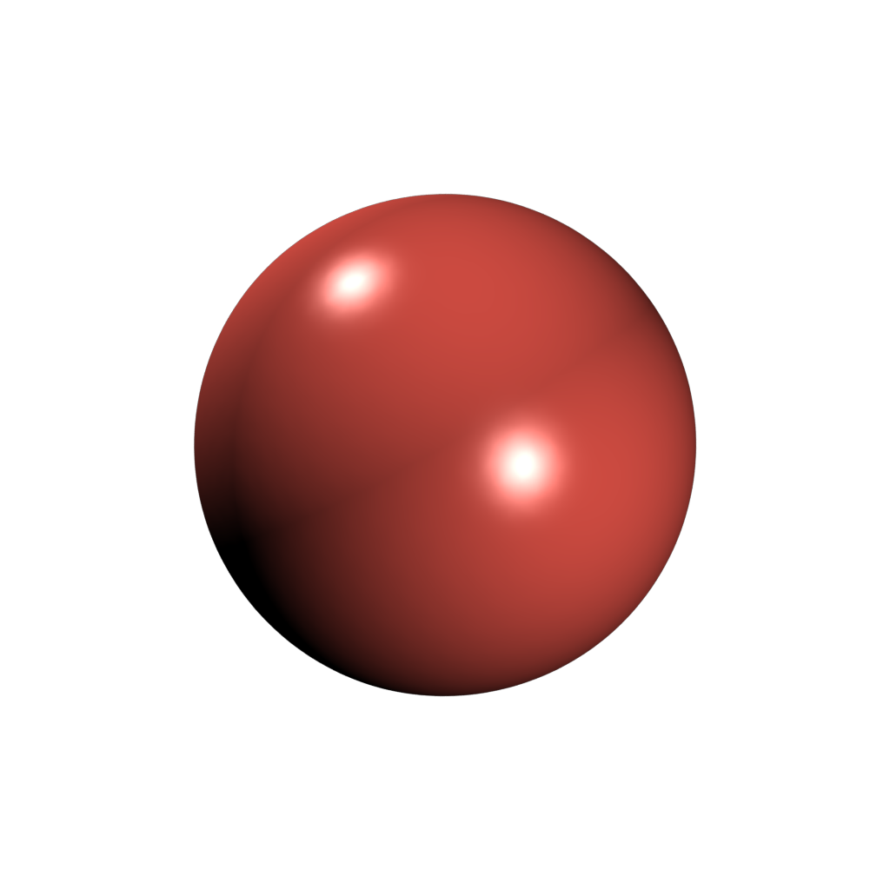
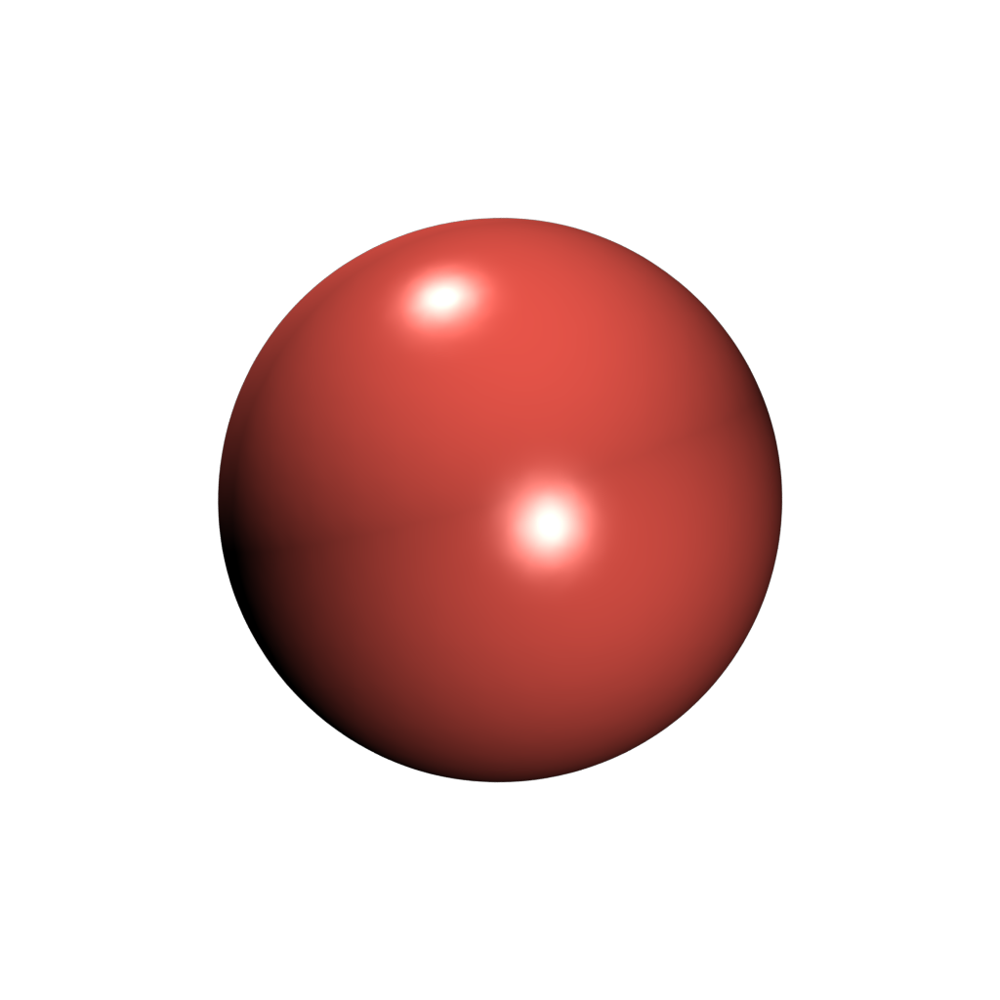
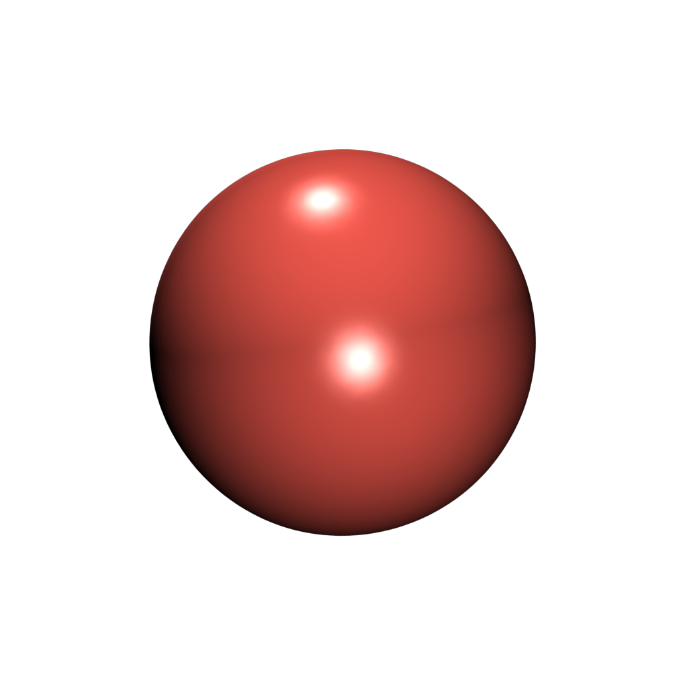
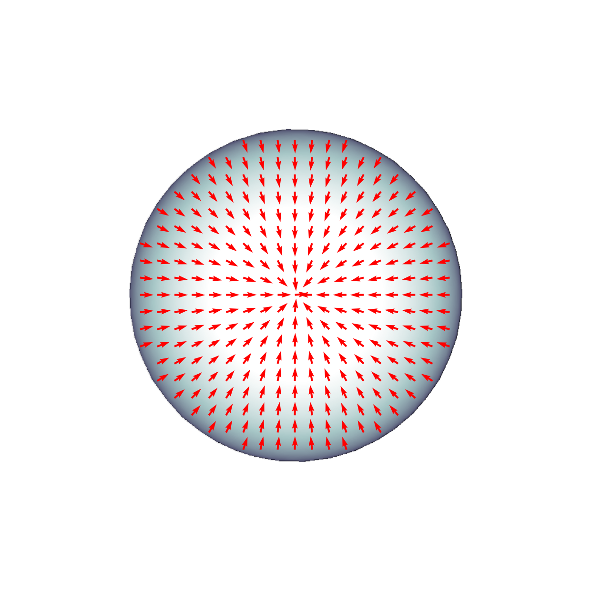
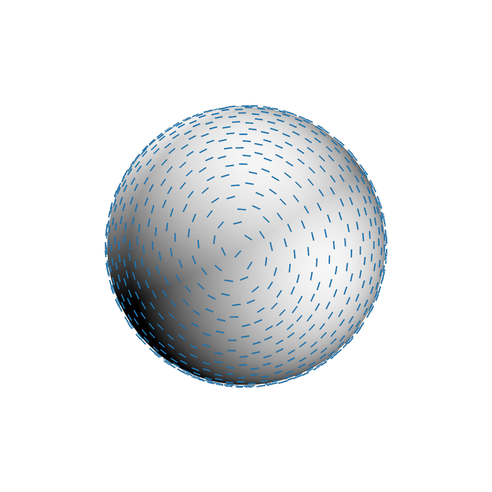
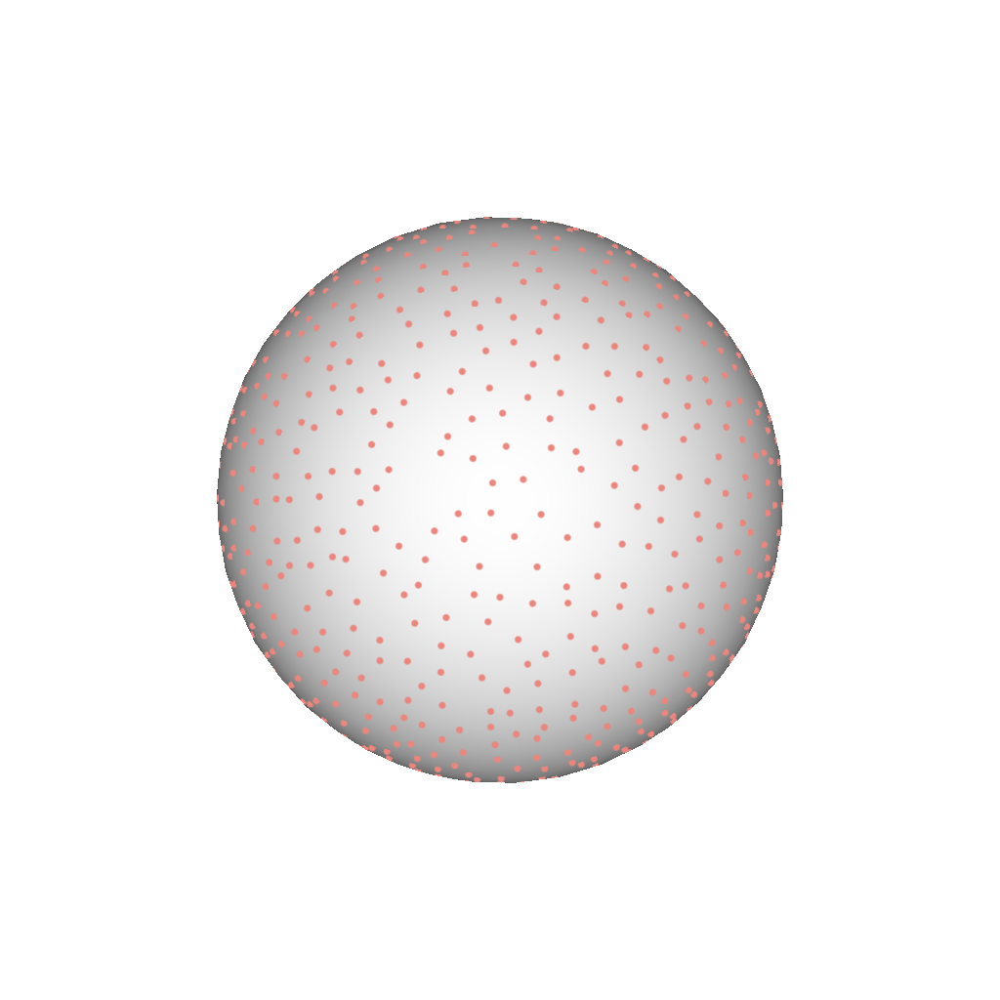

## Gallery

### src

|  Exemplar  |  Reference Rendering  | Brush Texture |
| ---- | ---- | ---- |
|    |   |    |

### target

Reference rendering frames:
|  frame 2  |  frame 3 | frame 4 |
| ---- | ---- | ---- |
|    |   |    |

### [dst](dst)

|  Color Transfer  |  Length Transfer  | Width Transfer | Final Rendering |
| ---- | ---- | ---- | ---- |
|    |    |    |    |

### [temp](temp)

|  Features  |  Canonical Sections  | Orientations | Anchor Points |
| ---- | ---- | ---- | ---- |
|    |    |    |    |