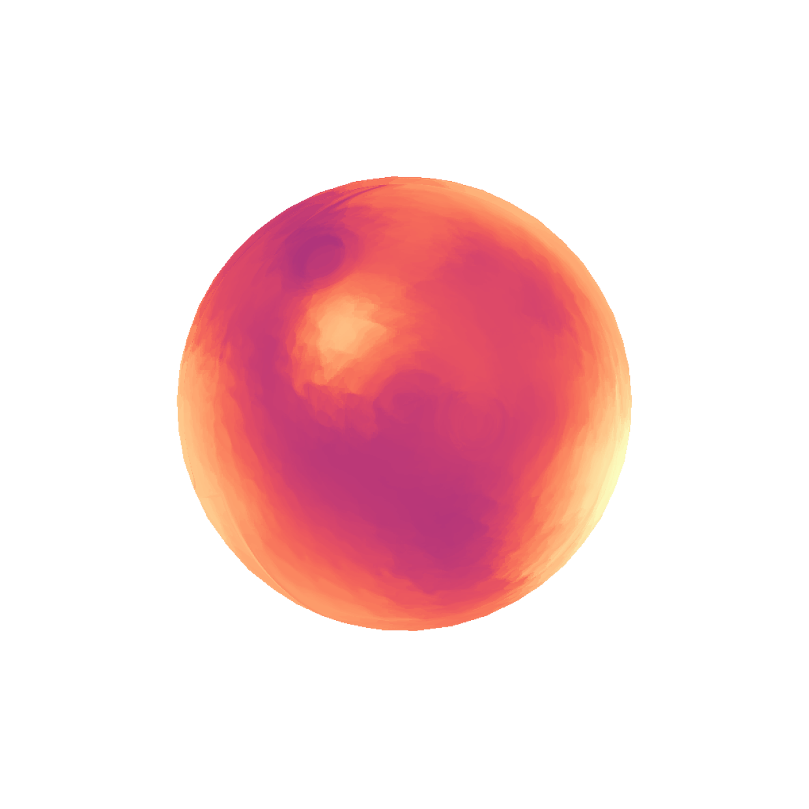

## Directory Structures

dst directory includes the outputs of the command line tools in the following (in pipeline order):

- regression
  - orientation_model.pickle: the model output of orientation regression.
  - color_model.pickle: the model output of color regression.
  - length_model.pickle: the model output of length regression.
  - width_model.pickle: the model output of width regression.
- transfer
  - orientation/orientation_%03d.json: sequence of transferred orientation field data (.json).
  - color/color_%03d.png: sequence of transferred color field images (.png).
  - length/length_%03d.png: sequence of transferred length field images (.png).
  - width/width_%03d.png: sequence of transferred width field images (.png).
- smoothing
  - orientation/orientation_%03d.json: sequence of filtered orientation field data (.json).
- anchor_points
  - anchor_points/anchor_points_%03d.json: sequence of anchor points data (.json)
- stroke
  - stroke/stroke_%03d.png: intermediate rendered images (.png) without the undercoat layer.
  - final/final_%03d.png: final rendered images (.png) with the undercoat layer.

## Gallery

Some of output data are visualized as images.

#### Transfer

|  Color Transfer  |  Length Transfer  | Width Transfer |
| ---- | ---- | ---- |
|    |    |    |

#### Stroke

|  Stroke Layer  |  Final Rendering  | 
| ---- | ---- | ---- |
|    |    |

Final rendering frames.
|  Frame 1  |  Frame 2  |  Frame 3  |  Frame 4 |  Frame 5  |  
| ---- | ---- | ---- | ---- | ---- |
|    |    |    |    |    |

Additional visualizations are available in the [temp](../temp) directory.