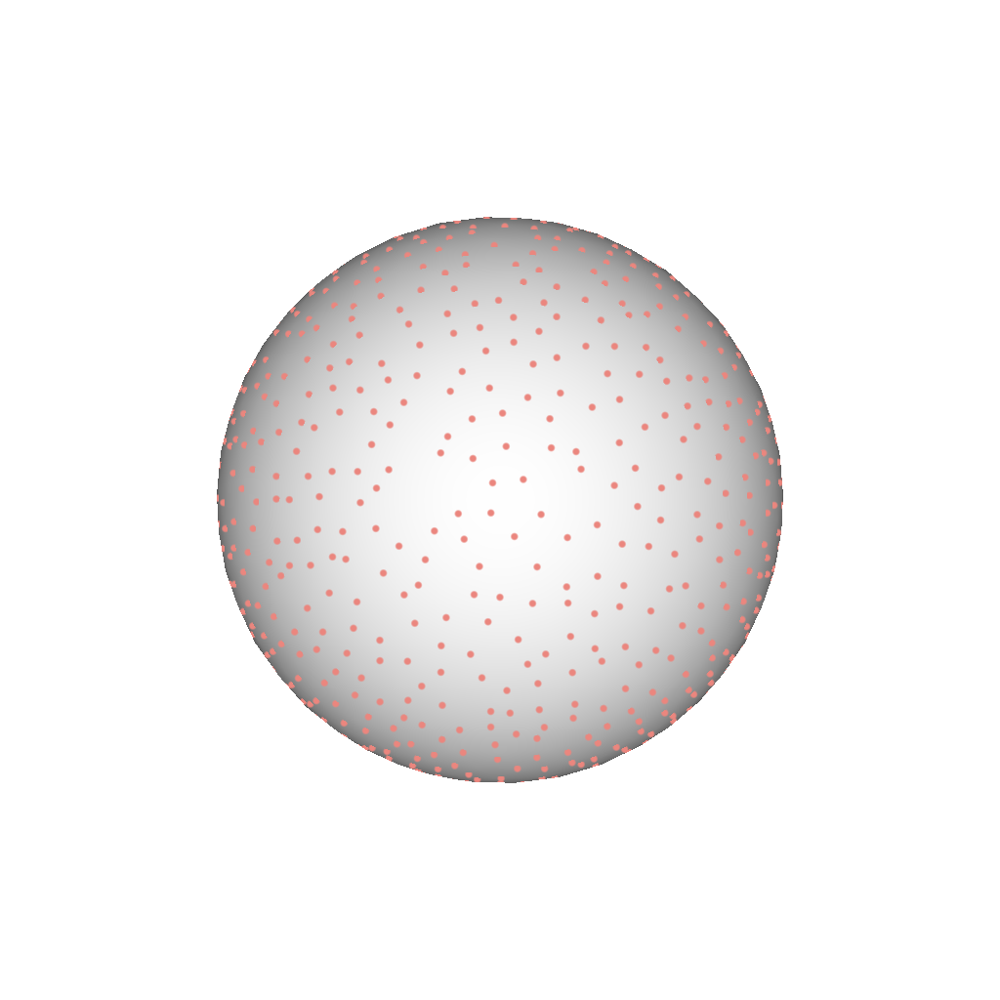

## Directory Structures

temp directory includes the internal data or additional visualizations of the command line tools in the following (in pipeline order):

- regression
  - annotation_plot: includes optional annotation plot image.
  - gbuffers: intermediate image data.
  - features: include feature field visualization. 
  - canonical_sections: include canonical section visualization.
  - weights: include weight field visualization of orientation regression.
  - model_matrix: include the model matrix of the orientation regression.
- transfer
  - gbuffers: intermediate image data.
  - features: include feature field visualization. 
  - canonical_sections: include canonical section visualization.
  - weights: include weight field visualization of orientation transfer.
  - smoothing: internal matrix data (e.g. discrete Hodge Star matrix) are stored.
  - view_orientations: transferred orientations and filtered orientations are visualized.
- anchor_points
  - anchor_points_%d: anchor point visualization at each level.
- stroke
  - index: anchor point indices used for the start points of drawn strokes.
  - angular.json: stores angle offset data to generate random stroke orientations.

## Gallery

Some of internal data are visualized as images.

#### Annotation Plot

Optional annotation plot for visualization.

#### Features

Selected set of the feature fields are listed here:

|  I_d  |  I_s  | n_x | H | d_S |
| ---- | ---- | ---- | ---- | ---- |
|    |    |   |   |   |

#### Canonical Sections

Selected set of the canonical sections are listed here:

|  I_d_parallel  |  n_perp |  o_perp |
| ---- | ---- | ---- |
|     |   |   |

#### Anchor Points

|  level 1  |  level 2 |  level 3 | level 4 |
| ---- | ---- | ---- | ---- |
|     |    |    |    |