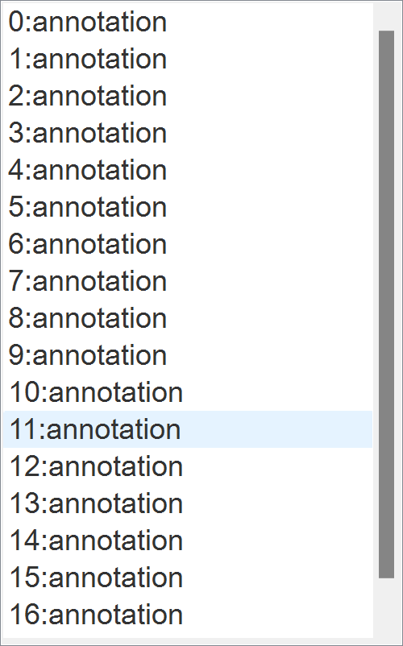

# Annotation Tool Manual

## User Interface

The tool consists of:
- Tool buttons: contains tool action for opening image, visible controls for annotations and orientations, data io functions for annotations.
- Main canvas: space where you can annotate orientations, and width (length will be automatically computed).
- Width slider: simple width controller for the next/selected target annotation.
- Color settings: contains key visual settings to change colors.
- Annotation list: simple list selection used for changing width or removing an annotation.

## Annotation Steps

#### 1. Open Exemplar Image

| Inputs   | Description | 
| ---- | ---- | 
|  Open Image Button (Ctrl + I)   | Open exemplar image (.png) with file dialog. |

Note: If you run the annotation tool from our command line tool interface, the exemplar image will be loaded on the initial state.

#### 2. Making Annotations

You can add annotations using the following inputs.

##### Insert Annotations
| Inputs   | Description | 
| ---- | ---- | 
|  Click | Add a new vertex for the current annotation.  |
| Double-Click | Add the last vertex for the current annotation and append it to the annotation list.   |
| Add Button (Enter)    | Append the current annotation to the annotation list.   |

##### Select Annotation

| Inputs   |  Description |
| ---- | ---- |  
|  Select on Annotation List UI    | Select an annotation for width control and deleting. |

##### Change Annotation Width

| Inputs   | Description | 
| ---- | ---- | 
| Width Slider    | Change the width of the selected annotation.    The width value is also used for current annotation.|

##### Delete Annotation

| Inputs   | Description | 
| ---- | ---- | 
| Delete Button (Delete)     | 1. Select an annotation from Annotation List UI.   2. Delete the selected annotation. |

##### Visible Control
| Inputs   | Description | 
| ---- | ---- | 
| Visible Annotation Button    |  Show/hide annotations.  |
| Visible Orientation Button    |  Show/hide interpolated orientations (vector field).  |

#### 3. Save Annotation Data

| Inputs   | Description | 
| ---- | ---- | 
| Save Annotation Button (Ctrl + S)     |Save annotation data (.json) with the file dialog. |

#### 4. Open Annotation Data

| Inputs   | Description | 
| ---- | ---- | 
| Open Annotation Button (Ctrl + O)     |Open annotation data (.json) with the file dialog. |