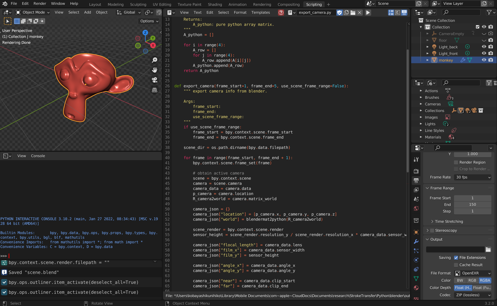

# Export Data From Blender

## Blender Scene Script

You can export camera parameters and object data using the blender scripts (please see [assets/monkey/blender/scene.blend](../assets/monkey/blender/scene.blend)).



#### export_camera.py

The monkey example include the sample script to export camera parameters.

- Active camera (referenced from ```bpy.context.scene.camera```) will be exported by the script.

```python
import bpy
import os

import numpy as np
import json


def blendermat2python(A):
    """ Convert blender matrix data to python array matrix.
    Args:
        A: blender matrix data (mathutils.Matrix).

    Returns:
        A_python: pure python array matrix.
    """
    A_python = []

    for i in range(4):
        A_row = []
        for j in range(4):
            A_row.append(A[i][j])
        A_python.append(A_row)
    return A_python


def export_camera(frame_start=1, frame_end=5, use_scene_frame_range=False):
    """ export camera info from blender.

    Args:
        frame_start:
        frame_end:
        use_scene_frame_range:
    """
    if use_scene_frame_range:
        frame_start = bpy.context.scene.frame_start
        frame_end = bpy.context.scene.frame_end

    scene_dir = os.path.dirname(bpy.data.filepath)

    for frame in range(frame_start, frame_end + 1):
        bpy.context.scene.frame_set(frame)

        # obtain active camera
        scene = bpy.context.scene
        camera = scene.camera
        camera_data = camera.data
        p_camera = camera.location
        R_camera2world = camera.matrix_world

        camera_json = {}
        camera_json["location"] = [p_camera.x, p_camera.y, p_camera.z]
        camera_json["world"] = blendermat2python(R_camera2world)

        scene_render = bpy.context.scene.render
        sensor_height = scene_render.resolution_y / scene_render.resolution_x * camera_data.sensor_width

        camera_json["flocal_length"] = camera_data.lens
        camera_json["film_x"] = camera_data.sensor_width
        camera_json["film_y"] = sensor_height

        camera_json["angle_x"] = camera_data.angle_x
        camera_json["angle_y"] = camera_data.angle_y

        camera_json["near"] = camera_data.clip_start
        camera_json["far"] = camera_data.clip_end

        fovy = camera_data.angle_x if camera_data.sensor_width >= sensor_height else camera_data.angle_y
        f = 1 / np.tan(fovy / 2)
        aspect = camera_data.sensor_width / sensor_height
        near = camera_data.clip_start
        far = camera_data.clip_end
        p_mat = [[f, 0, 0, 0], [0, f * aspect, 0, 0],
                 [0, 0, -(far + near) / (far - near), -2 * far * near / (far - near)], [0, 0, -1, 0]]

        camera_json["project_mat"] = p_mat

        # output.
        data_json = {}
        data_json["camera"] = camera_json

        filepath = os.path.join(scene_dir, 'camera/camera_{:03}.json'.format(frame))
        os.makedirs(os.path.dirname(filepath), exist_ok=True)
        with  open(filepath, 'w') as f:
            json.dump(data_json, f, indent=4)


# 5 frames camera data will be exported.
export_camera(frame_start=1, frame_end=5, use_scene_frame_range=False)

# blender frame settings are used to export camera data.
# export_camera(frame_start=1, frame_end=1, use_scene_frame_range=True)
```

The output json file (e.g. [camera_001.json](../assets/monkey/blender/camera/camera_001.json)) include the following parameters.

```
{
    "camera": {
        "location": [
            0.0,
            -7.0,
            5.0
        ],
        "world": [[1.0, 0.0, 0.0, 0.0],
                  [0.0, 0.5735764503479004, -0.8191520571708679, -7.0],
                  [0.0, 0.8191520571708679, 0.5735764503479004, 5.0],
                  [0.0, 0.0, 0.0, 1.0]],
        "flocal_length": 90.0,
        "film_x": 36.0,
        "film_y": 36.0,
        "angle_x": 0.3947911262512207,
        "angle_y": 0.2651030719280243,
        "near": 0.0010000000474974513,
        "far": 100.0,
        "project_mat": [[4.999999914831032, 0, 0, 0],
                        [0, 4.999999914831032, 0, 0],
                        [0, 0, -1.000020000200952, -0.0020000200951968044],
                        [0, 0, -1, 0]]
    }
}
```

### export_object.py

The monkey example include the sample script to export object data (.obj).

- Only visible objects (check ```obj.visible_get()```) will be exported.
- All transforms are applied.
- Without materials.

Note: you can also use File > Export > Wavefront (.obj) menu to export 3D model data, if you want.

``` python
import bpy
import os


def export_object(frame_start, frame_end, use_scene_frame_range):
    """ export 3D object data (.obj) from blender.
    
    Note: only export visible objects (skip hidden objects).

    Args:
        frame_start: first frame number.
        frame_end: last frame number.
        use_scene_frame_range: if True, frame_start and frame_end will be set from belnder scene setting.
    """

    if use_scene_frame_range:
        frame_start = bpy.context.scene.frame_start
        frame_end = bpy.context.scene.frame_end

    scene_dir = os.path.dirname(bpy.data.filepath)

    for obj in bpy.data.objects:
        if obj.type == 'MESH':
            if obj.visible_get():
                obj.select_set(True)
            else:
                obj.select_set(False)

    for frame in range(frame_start, frame_end + 1):
        bpy.context.scene.frame_set(frame)
        filepath = os.path.join(scene_dir, 'object/object_{:03}.obj'.format(frame))

        os.makedirs(os.path.dirname(filepath), exist_ok=True)
        bpy.ops.export_scene.obj(filepath=filepath, use_mesh_modifiers=True, use_selection=True, 
                                 use_materials=False, use_triangles=True)
        

# 5 frames object data will be exported.
export_object(frame_start=1, frame_end=5, use_scene_frame_range=False)

# blender frame settings are used to export object data.
# export_object(frame_start=1, frame_end=1, use_scene_frame_range=True)
```

### Other Requirements

These shading/lighting elements can be exported as usual rendering steps.

- diffuse/diffuse_%03d.exr:  diffuse image (.exr) sequences.
- specular/specular_%03d.exr: specular image (.exr) sequences.

Note: we assume OpenEXR format for these illumination elements.

## Command Line Tool (Optional)

If you want, you can use command line tools to run:

- [blender/export_camera.py](../python/blender/export_camera.py)
- [blender/export_object.py](../python/blender/export_object.py)

You can simply do:

- export the target data using the specified frame range parameters.
```shell
blender scene.blend --background --python ../../python/blender/export_camera.py  -- --frame_start 1 --frame_end 5
```

- export target data using the scene frame range settings.

```shell
blender scene.blend --background --python ../../python/blender/export_camera.py  -- --frame_start 1 --frame_end 1 --use_scene_frame_range
```